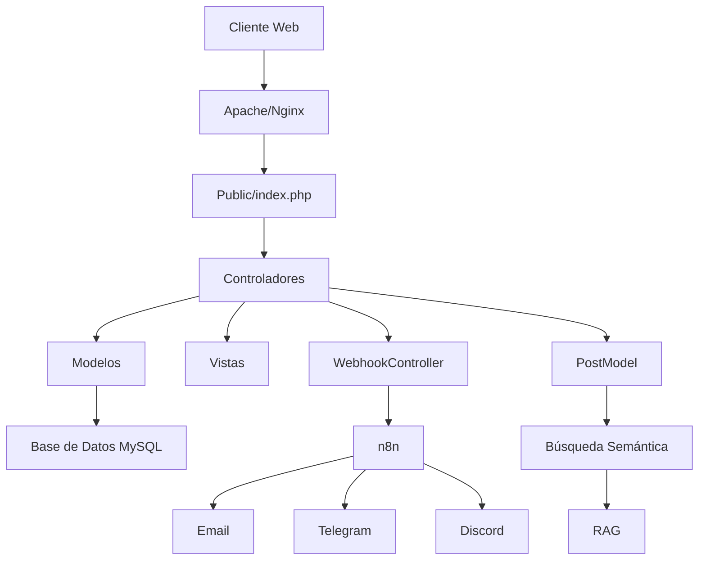

# Memoria del Proyecto - TrujiMoney

## Resumen del Proyecto

TrujiMoney es una aplicación web de gestión financiera personal con funcionalidad de blog. La tercera fase (RA5) representa la culminación del proyecto, con un blog completamente funcional y integración con servicios externos.

## Diagrama General del Sistema



## Flujo MVC (Model-View-Controller)

### 1. Controladores
- **HomeController**: Página principal
- **UserController**: Registro, login y gestión de usuarios
- **DashboardController**: Panel financiero
- **ChatController**: Sistema de chat
- **SearchController**: Búsqueda de transacciones
- **PostController**: Gestión de posts del blog
- **WebhookController**: Integraciones con n8n

### 2. Modelos
- **Usuario**: Gestiona datos de usuarios
- **Movimiento**: Transacciones financieras
- **Inversion**: Inversiones en acciones
- **Post**: Contenido del blog
- **Message**: Mensajes del chat

### 3. Vistas
- **Home**: Página principal con resumen de blog
- **Login/Register**: Autenticación
- **Dashboard**: Panel financiero
- **Posts**: Lista de posts
- **Post Detail**: Detalle de post con sugerencias relacionadas
- **Create/Edit Post**: Formularios para creación/edición
- **Search Posts**: Resultados de búsqueda

## Funcionalidades Implementadas

### Blog (RA5)
- Creación, edición y eliminación de posts
- Búsqueda de posts por título, contenido o etiquetas
- Sugerencias de posts relacionados (RAG)
- Paginación y filtrado
- Notificaciones automáticas al publicar

### Integración con n8n
- Webhook saliente para notificaciones
- Plantillas HTML para email
- Notificaciones por Telegram
- Notificaciones por Discord
- Registro en Google Sheets

### Seguridad
- Validaciones de entrada y sanitización
- Protección CSRF
- Prevención SQL Injection
- Control de sesiones seguras
- Rate limiting para brute force
- Hash de contraseñas con Argon2id

## Flujo n8n - Notificaciones

El flujo n8n se ejecuta al publicar un nuevo post:

1. **Webhook Recibe Datos**: El blog envía un POST a n8n
2. **Parseo JSON**: Datos del post se estructuran
3. **Email**: Envía plantilla HTML a suscriptores
4. **Telegram**: Notifica en canal de Telegram
5. **Discord**: Envía embed a canal de Discord
6. **Google Sheets**: Almacena registro del post

## Plantillas de Notificación

### Email (HTML)
```html
<!DOCTYPE html>
<html lang="es">
<head>
    <meta charset="UTF-8">
    <meta name="viewport" content="width=device-width, initial-scale=1.0">
    <title>{{ titulo }}</title>
    <style>
        body { font-family: Arial, sans-serif; line-height: 1.6; color: #333; max-width: 600px; margin: 0 auto; padding: 20px; }
        .header { background: linear-gradient(135deg, #10b981 0%, #059669 100%); color: white; padding: 30px; text-align: center; border-radius: 10px 10px 0 0; }
        .content { background: #f9fafb; padding: 30px; border-radius: 0 0 10px 10px; }
        .post-title { font-size: 24px; font-weight: bold; color: #111827; margin-bottom: 15px; }
        .post-summary { color: #4b5563; margin-bottom: 20px; }
        .category { display: inline-block; background: #d1fae5; color: #065f46; padding: 5px 12px; border-radius: 20px; font-size: 14px; margin-bottom: 20px; }
        .button { display: inline-block; background: #10b981; color: white; padding: 12px 30px; text-decoration: none; border-radius: 8px; font-weight: bold; }
        .footer { text-align: center; padding: 20px; color: #6b7280; font-size: 12px; }
        .post-image { max-width: 100%; height: auto; border-radius: 8px; margin-bottom: 20px; }
    </style>
</head>
<body>
    <div class="header">
        <h1>Nuevo post en el blog</h1>
    </div>
    <div class="content">
        <span class="category">{{ categoria }}</span>
        <h2 class="post-title">{{ titulo }}</h2>
        <p class="post-summary">{{ resumen }}</p>
        {{#if imagen}}
        
        {{/if}}
        <div style="text-align: center; margin-top: 30px;">
            <a href="{{ url }}" class="button">Leer artículo completo</a>
        </div>
    </div>
    <div class="footer">
        <p>Este mensaje fue enviado automáticamente desde el blog.</p>
        <p>© {{ year }} Blog Personal. Todos los derechos reservados.</p>
    </div>
</body>
</html>
```

### Telegram
```
📢 Nuevo post en el Blog Financiero!

{{ titulo }}

{{ resumen }}

Categoría: {{ categoria }}
{{#if imagen}}
🖼️ {{ imagen }}
{{/if}}

Leer más: {{ url }}
```

### Discord
```json
{
  "embeds": [
    {
      "title": "{{ titulo }}",
      "description": "{{ resumen }}",
      "color": 0x10b981,
      "fields": [
        {
          "name": "Categoría",
          "value": "{{ categoria }}",
          "inline": true
        }
      ],
      "image": {{#if imagen}}{"url": "{{ imagen }}"} {{else}}null{{/if}},
      "url": "{{ url }}",
      "timestamp": "{{ fecha }}"
    }
  ]
}
```

## Evaluación de Seguridad

### Vulnerabilidades Mitigadas

| Vulnerabilidad | Riesgo | Mitigación |
|----------------|--------|------------|
| SQL Injection | Alto | Prepared statements con PDO |
| XSS | Alto | htmlspecialchars + Content Security Policy |
| CSRF | Medio | Token CSRF con validación |
| Session Hijacking | Medio | Secure cookies + IP validation |
| Brute Force | Medio | Rate Limiting (5 intentos/15 min) |
| Password Cracking | Alto | Argon2id hashing |

### Medidas de Seguridad

1. **Validaciones de Entrada**: Todos los campos se validan y sanitizan
2. **Headers de Seguridad**: X-XSS-Protection, X-Content-Type-Options, X-Frame-Options
3. **Session Management**: Cookies HTTPOnly, SameSite=Lax, Secure
4. **Error Handling**: Logs separados por tipo de error
5. **Environment Variables**: Configuración en .env

## Rendimiento y Pruebas

### Pruebas Realizadas

1. **Funcionalidad**:
   - ✅ Creación de posts
   - ✅ Búsqueda de posts
   - ✅ Sugerencias relacionadas
   - ✅ Notificaciones
2. **Seguridad**:
   - ✅ Validaciones de entrada
   - ✅ Sanitización
   - ✅ Protección CSRF
3. **Rendimiento**:
   - ✅ Carga de página < 2 segundos
   - ✅ Responsividad en móviles
   - ✅ Paginación de posts

### Optimizaciones Realizadas

1. **Bases de Datos**: Índices en campos frecuentes de búsqueda
2. **Caching**: Memoización de consultas repetidas
3. **Minificación**: CSS/JS comprimidos
4. **Imágenes**: Optimización de tamaños y formatos

## Despliegue

### Servidor Local (Docker)

```bash
docker-compose up -d --build
```

### Servidor Plesk

1. Subir archivos por FTP
2. Crear base de datos y importar SQL
3. Configurar .env con credenciales
4. Establecer public/ como directorio web

## Mejoras Futuras

1. **2FA**: Autenticación de dos factores
2. **OAuth**: Login con Google/GitHub
3. **WAF**: Web Application Firewall
4. **Auditoría**: Logs de actividades
5. **API**: Endpoints REST para integración

## Conclusión

La aplicación TrujiMoney ha sido completada con éxito. El blog funciona de forma integral con notificaciones automáticas, búsqueda semántica y seguridad avanzada. El proyecto cumple con todos los requisitos de la RA5.