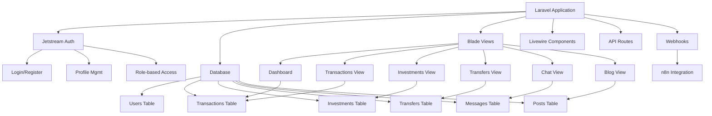

# Laravel Migration Plan for Financial Management Application

## Project Overview
Migrate the current custom PHP framework-based financial management application to Laravel 10 with Jetstream authentication and Tailwind CSS.

## Current Application Structure
The application includes:
- **Users**: Authentication, registration, profiles (admin and user roles)
- **Financial Transactions**: Income/expense tracking with categories
- **Investments**: Stock portfolio management
- **Transfers**: Peer-to-peer money transfers
- **Posts**: Blog system with search and suggestions (admin only)
- **Chat**: Real-time messaging between users
- **Webhooks**: Integration with n8n for notifications

## Database Structure
| Table | Description |
|-------|-------------|
| `usuarios` | User accounts with roles (admin/user) |
| `movimientos` | Financial transactions (income/expense) |
| `inversiones` | Stock investments |
| `transfers` | Peer-to-peer transfers |
| `messages` | Chat messages |
| `posts` | Blog posts with full-text search |

## Migration Steps

### 1. Project Setup
- Create new Laravel 10 project
- Install Jetstream with Livewire and Teams
- Configure Tailwind CSS
- Set up environment variables

### 2. Database Migration
- Create Laravel migrations for all tables
- Modify table names to follow Laravel conventions (plural, snake_case)
- Set up foreign key relationships
- Create seeders for demo data

### 3. Model Creation
- Create Eloquent models for all entities
- Define relationships (User has many Transactions, Investments, Transfers, Messages, Posts)
- Implement model scopes and accessors/mutators

### 4. Authentication & Authorization
- Utilize Jetstream for authentication
- Implement role-based authorization (admin/user)
- Customize login/registration views
- Add session security features

### 5. Controller Development
- Create resource controllers for each entity
- Implement CRUD operations
- Add validation rules
- Handle file uploads if needed

### 6. Route Configuration
- Define RESTful routes for all features
- Apply appropriate middleware (auth, role check)
- Create API routes if needed

### 7. View Development
- Convert existing PHP views to Blade templates
- Use Tailwind CSS for styling
- Create responsive layouts
- Implement real-time features with Livewire or Alpine.js

### 8. Feature Implementation
#### Dashboard
- Show balance, monthly income/expenses
- Display recent transactions
- Add transaction search functionality

#### Transactions
- Create, view, search transactions
- Filter by type, category, date
- Calculate balance and statistics

#### Investments
- Buy/sell stocks
- Track portfolio value
- Show investment history

#### Transfers
- Send/receive money between users
- View transfer history
- Add transfer descriptions

#### Chat
- Real-time messaging
- User-to-user conversations
- Message history

#### Posts
- Blog system with admin panel
- Post creation/editing/deletion
- Search and related posts suggestions
- n8n webhook integration

### 9. Testing
- Write feature and unit tests
- Test authentication and authorization
- Verify all CRUD operations
- Test real-time features
- Perform load testing

### 10. Data Migration
- Migrate existing data from old database
- Handle any data format changes
- Verify data integrity

### 11. Deployment
- Configure production environment
- Set up database connection
- Deploy to hosting provider
- Test the live application

## Architecture Diagram

## Technology Stack
- **Framework**: Laravel 10
- **Authentication**: Laravel Jetstream (Livewire)
- **Styling**: Tailwind CSS
- **Database**: MySQL 8.0
- **Real-time**: Livewire/Alpine.js
- **Testing**: PHPUnit
- **Webhooks**: Guzzle HTTP

## Timeline
The migration process will be completed in phases:
1. Project setup and database migration (2 days)
2. Model and controller development (3 days)
3. View development and feature implementation (4 days)
4. Testing and data migration (2 days)
5. Deployment and final testing (1 day)

## Risks and Mitigations
- **Data Loss**: Perform full backup before migration, test data migration on staging
- **Feature Incomplete**: Prioritize core features (authentication, transactions, investments), add others incrementally
- **Performance Issues**: Optimize database queries, use caching, implement pagination
- **Security Vulnerabilities**: Follow Laravel security best practices, use Jetstream's built-in security features

## Success Criteria
- All existing features are functional in Laravel
- Application is responsive and user-friendly
- Authentication and authorization work correctly
- All data is migrated successfully
- Application is secure and performant
- Tests pass and code quality is high
